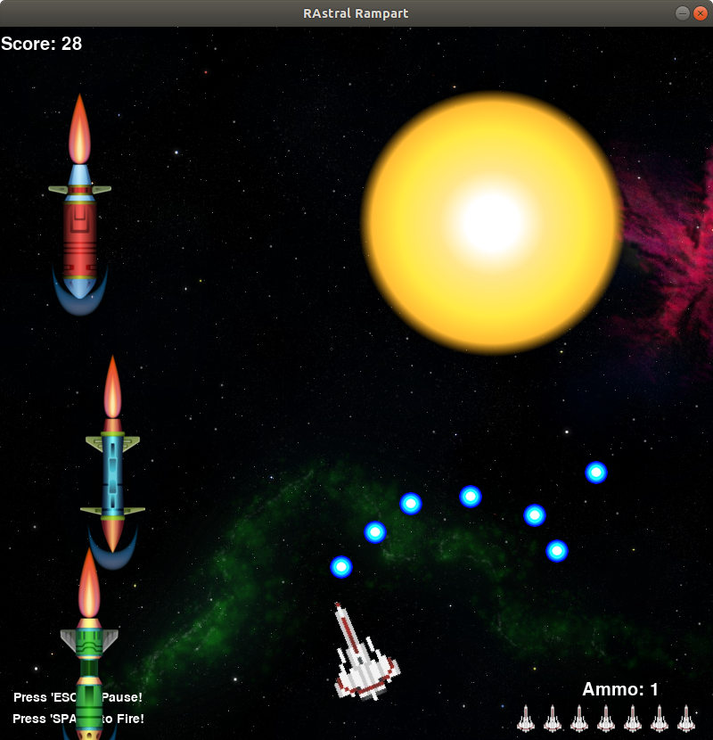
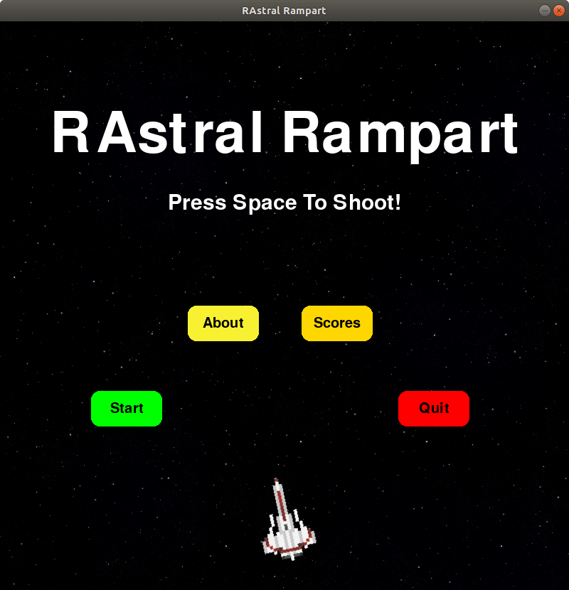

# RAstral Rampart

This is an arcade style space shooter that features a rotating gun at the bottom of the screen that rotates left and right without input from the player.

The player can hit the space bar to fire the gun, destroying incoming missiles!

If a missile explodes at the bottom of the screen, the player loses health.

There are also power-ups that the player can shoot!

Gameplay                   |  Menu
:-------------------------:|:-------------------------:
   |  

## Installation

### Windows

An MSI file can be found under the [releases tab](https://github.com/chwerth/RAstral_Rampart/releases).

### Running from source code

Required:
- Python 3.8+
- Pygame - [2.0.0.dev8](https://github.com/pygame/pygame/releases/tag/2.0.0.dev8)

Use Python 3.8 to execute main.py and the game will run.

## Developers

- Written by: [Caleb Werth](https://github.com/chwerth/) and [Russell Spry](https://github.com/Rw552)
- Idea by: Aaron Werth
